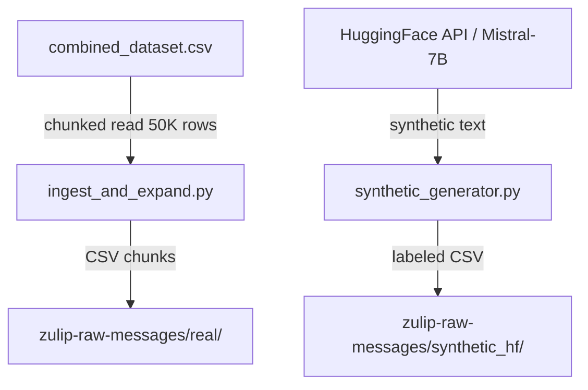
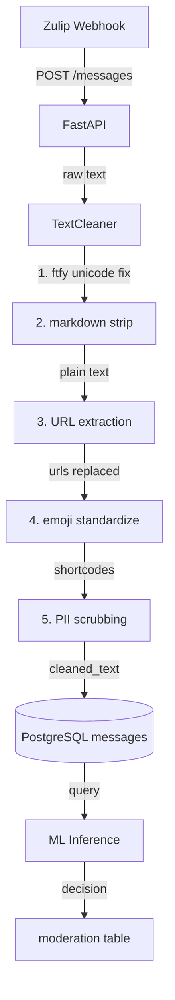
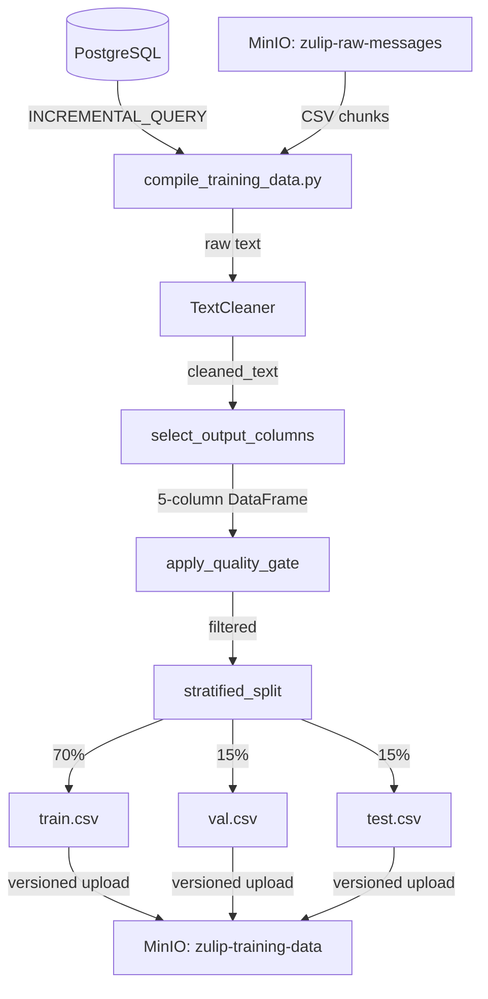

# Plan 04-01: Data Design Document

## Objective

Create the high-level data design document (`docs/data-design.md`) covering the ChatSentry data pipeline. This is a demo-video-ready artifact that documents schemas, data repositories, flow diagrams, API endpoints, and architectural decisions. Per D-01, scope is data pipeline only — no ML training, model serving, or DevOps.

**Purpose:** DESIGN-01 requirement; provides operator onboarding, demo talking points, and ML team reference for understanding data formats.
**Output:** `docs/data-design.md` with Mermaid diagrams, schema tables, and decision rationale.

## Context

@docker/init_sql/00_create_tables.sql
@docker/docker-compose.yaml
@src/data/text_cleaner.py
@src/data/compile_training_data.py
@src/data/ingest_and_expand.py

## Tasks

### Task 1: Write data design document

**Files:**
- Create: `docs/data-design.md`

**Action:**

Create `docs/data-design.md` with the following structure. Use exact values from the source files — do not approximate or paraphrase schema definitions.

**Section 1 — Overview** (brief, 3-5 sentences):
- What ChatSentry data pipeline does
- Scope: ingestion, preprocessing, batch compilation (data pipeline only, per D-01)
- Tech stack: Python 3.x, Docker Compose, PostgreSQL, MinIO, FastAPI

**Section 2 — PostgreSQL Schema Reference:**

Document all 4 tables from `docker/init_sql/00_create_tables.sql`:

```markdown
### users
| Column | Type | Constraints | Description |
|--------|------|-------------|-------------|
| id | UUID | PRIMARY KEY, DEFAULT gen_random_uuid() | Unique user identifier |
| username | VARCHAR(255) | NOT NULL, UNIQUE | Username |
| email | VARCHAR(255) | — | User email (optional) |
| created_at | TIMESTAMPTZ | DEFAULT NOW() | Account creation timestamp |
| source | VARCHAR(32) | NOT NULL, DEFAULT 'real', CHECK (real, synthetic_hf) | Data source origin |
```

Repeat for: `messages`, `flags`, `moderation` tables. Include the GIN index on `messages.text`.

**Section 3 — MinIO Bucket Structure:**

```markdown
### zulip-raw-messages
Ingested and synthetic data, organized by source.
├── real/
│   └── combined_dataset/
│       ├── chunk_000.csv
│       ├── chunk_001.csv
│       └── ...
└── synthetic_hf/
    └── generated/
        └── batch_NNN.csv

### zulip-training-data
Versioned training data snapshots and Data Docs.
├── v20260403-142301/
│   ├── train.csv
│   ├── val.csv
│   └── test.csv
└── data_docs/
    └── index.html  (Great Expectations reports)
```

**Section 4 — Data Flow Diagrams** (3 Mermaid diagrams, per D-03):

Diagram 1: **Ingestion Flow**


Diagram 2: **Online Preprocessing Flow**


Diagram 3: **Batch Pipeline Flow**


**Section 5 — API Endpoints:**

Document POST /messages and POST /flags with Pydantic-style request/response schemas:

```markdown
### POST /messages
**Request:**
| Field | Type | Required | Description |
|-------|------|----------|-------------|
| text | str | Yes | Raw message text |
| user_id | str | Yes | UUID of the sender |
| source | str | No | Data origin: 'real' or 'synthetic_hf' (default: 'real') |

**Response (200):**
| Field | Type | Description |
|-------|------|-------------|
| message_id | str | UUID of the created message |
| status | str | Processing status |

### POST /flags
**Request:**
| Field | Type | Required | Description |
|-------|------|----------|-------------|
| message_id | str | Yes | UUID of the flagged message |
| flagged_by | str | Yes | UUID of the user who flagged |
| reason | str | Yes | One of: spam, harassment, hate_speech, self_harm, other |

**Response (200):**
| Field | Type | Description |
|-------|------|-------------|
| flag_id | str | UUID of the created flag |
| status | str | 'queued' or 'processed' |
```

**Section 6 — Key Architectural Decisions:**

Document these decisions with 1-2 sentence rationale each:
1. CSV over Parquet (simplicity; course requirement for object storage ingestion)
2. HuggingFace API for synthetic data (no GPU on KVM@TACC)
3. Frozen dataclass config (immutability prevents accidental mutation)
4. Two-phase batch pipeline (initial bulk-load + incremental re-compilation)
5. Prompt-guided labeling (labels from prompt instruction, not post-hoc classification)
6. TextCleaner as shared module (same cleaning for online and batch paths)

**Section 7 — TextCleaner Pipeline:**

Document the 5-step cleaning pipeline from `text_cleaner.py` with the exact order and what each step does:

| Step | Function | Input Example | Output Example |
|------|----------|---------------|----------------|
| 1 | fix_unicode | café | café |
| 2 | strip_markdown | **bold** text | bold text |
| 3 | extract_urls | visit https://x.com | visit [URL] |
| 4 | standardize_emojis | 😀 | :grinning_face: |
| 5 | scrub_pii | email user@test.com | email [EMAIL] |

**Verify:**
```bash
test -f docs/data-design.md && wc -l docs/data-design.md
```

**Done:** `docs/data-design.md` exists with 7 sections, 3 Mermaid diagrams, matches actual codebase schemas and API definitions.

## Verification

```bash
# File exists and has substantial content
test -f docs/data-design.md && echo "EXISTS" || echo "MISSING"
wc -l docs/data-design.md

# Mermaid blocks present
grep -c '```mermaid' docs/data-design.md  # Should be 3

# PostgreSQL tables referenced
grep -c 'CREATE TABLE' docs/data-design.md || grep -c 'users\|messages\|flags\|moderation' docs/data-design.md

# API endpoints documented
grep -c 'POST /messages\|POST /flags' docs/data-design.md
```

## Success Criteria

- `docs/data-design.md` exists with ≥150 lines covering all 7 sections
- 3 Mermaid flow diagrams present and syntactically correct
- PostgreSQL schema matches `00_create_tables.sql` exactly
- API endpoint schemas match FastAPI route definitions
- Architectural decisions include rationale from PROJECT.md

## Output

After completion, create `.planning/phases/04-design-doc-config/04-01-SUMMARY.md`
