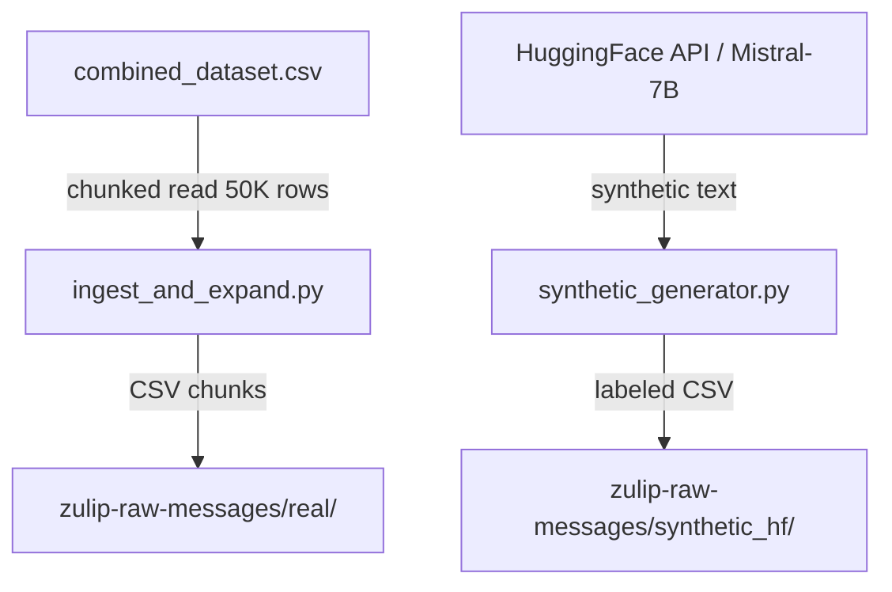
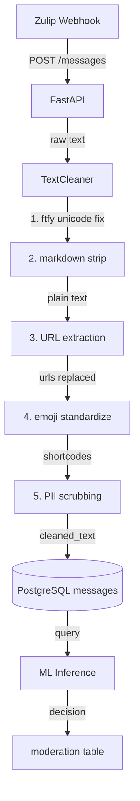
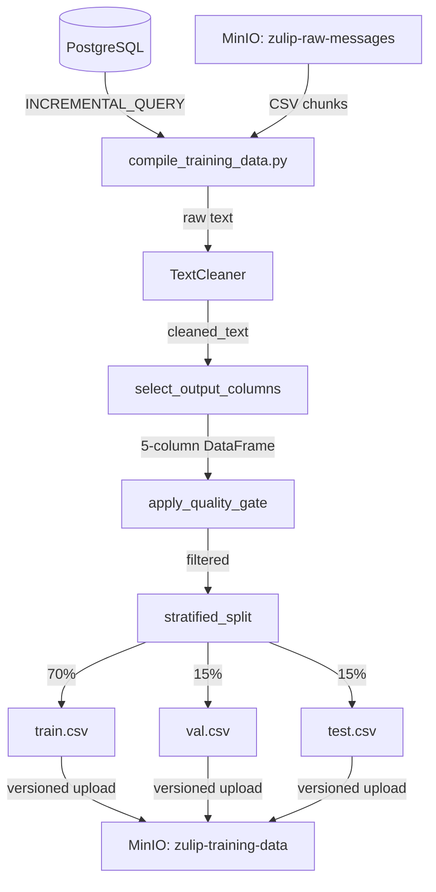

# ChatSentry Data Pipeline — Design Document

## 1. Overview

ChatSentry's data pipeline ingests toxic and suicide-detection datasets, expands them with synthetic HuggingFace-generated text, preprocesses raw chat messages in real time, and compiles versioned training data for the ML team. The pipeline scope covers ingestion, preprocessing, and batch compilation — no ML training, model serving, or DevOps infrastructure. The tech stack is Python 3.x, Docker Compose, PostgreSQL, MinIO (S3-compatible object storage), and FastAPI, all running on a single KVM@TACC VM with no GPU.

## 2. PostgreSQL Schema Reference

All tables use UUID primary keys via `gen_random_uuid()` (requires `pgcrypto` extension). Every data table tracks `source` with a CHECK constraint (`'real'` or `'synthetic_hf'`).

### users

| Column | Type | Constraints | Description |
|--------|------|-------------|-------------|
| id | UUID | PRIMARY KEY, DEFAULT gen_random_uuid() | Unique user identifier |
| username | VARCHAR(255) | NOT NULL, UNIQUE | Username |
| email | VARCHAR(255) | — | User email (optional) |
| created_at | TIMESTAMPTZ | DEFAULT NOW() | Account creation timestamp |
| source | VARCHAR(32) | NOT NULL, DEFAULT 'real', CHECK (source IN ('real', 'synthetic_hf')) | Data source origin |

### messages

| Column | Type | Constraints | Description |
|--------|------|-------------|-------------|
| id | UUID | PRIMARY KEY, DEFAULT gen_random_uuid() | Unique message identifier |
| user_id | UUID | NOT NULL, REFERENCES users(id) | Author foreign key |
| text | TEXT | NOT NULL | Raw message text |
| cleaned_text | TEXT | — | Preprocessed text (nullable until cleaned) |
| is_toxicity | BOOLEAN | DEFAULT FALSE | Toxicity label |
| is_suicide | BOOLEAN | DEFAULT FALSE | Self-harm label |
| source | VARCHAR(32) | NOT NULL, DEFAULT 'real', CHECK (source IN ('real', 'synthetic_hf')) | Data source origin |
| created_at | TIMESTAMPTZ | DEFAULT NOW() | Message creation timestamp |

**Index:** GIN full-text search index on `messages.text`:

```sql
CREATE INDEX idx_messages_text_fts
    ON messages USING GIN (to_tsvector('english', text));
```

### flags

| Column | Type | Constraints | Description |
|--------|------|-------------|-------------|
| id | UUID | PRIMARY KEY, DEFAULT gen_random_uuid() | Unique flag identifier |
| message_id | UUID | NOT NULL, REFERENCES messages(id) | Flagged message foreign key |
| flagged_by | UUID | REFERENCES users(id) | User who raised the flag |
| reason | TEXT | — | Free-text flag reason |
| is_verified | BOOLEAN | DEFAULT FALSE | Admin verification status |
| source | VARCHAR(32) | NOT NULL, DEFAULT 'real', CHECK (source IN ('real', 'synthetic_hf')) | Data source origin |
| created_at | TIMESTAMPTZ | DEFAULT NOW() | Flag creation timestamp |

### moderation

| Column | Type | Constraints | Description |
|--------|------|-------------|-------------|
| id | UUID | PRIMARY KEY, DEFAULT gen_random_uuid() | Unique moderation decision ID |
| message_id | UUID | NOT NULL, REFERENCES messages(id) | Moderated message foreign key |
| action | VARCHAR(50) | NOT NULL | Decision action (hide/warn/pass) |
| confidence | FLOAT | — | Model confidence score |
| model_version | VARCHAR(100) | — | Model version used for decision |
| source | VARCHAR(32) | NOT NULL, DEFAULT 'real', CHECK (source IN ('real', 'synthetic_hf')) | Data source origin |
| decided_at | TIMESTAMPTZ | DEFAULT NOW() | Decision timestamp |

## 3. MinIO Bucket Structure

Two S3-compatible buckets store raw ingested data and versioned training snapshots.

### zulip-raw-messages

Ingested and synthetic data, organized by source.

```
zulip-raw-messages/
├── real/
│   └── combined_dataset/
│       ├── chunk_000.csv
│       ├── chunk_001.csv
│       ├── chunk_002.csv
│       └── ...
└── synthetic_hf/
    └── generated/
        └── batch_NNN.csv
```

- `real/combined_dataset/` — 50K-row CSV chunks from `combined_dataset.csv` ingestion
- `synthetic_hf/generated/` — LLM-generated Zulip-style messages from HuggingFace API

### zulip-training-data

Versioned training data snapshots and Great Expectations Data Docs.

```
zulip-training-data/
├── v20260403-142301/
│   ├── train.csv   (70% of data)
│   ├── val.csv     (15% of data)
│   └── test.csv    (15% of data)
├── v20260404-091500/
│   ├── train.csv
│   ├── val.csv
│   └── test.csv
└── data_docs/
    └── index.html  (Great Expectations validation reports)
```

- Versioned folders use UTC timestamp tags (`v%Y%m%d-%H%M%S`)
- Each snapshot contains stratified 70/15/15 train/val/test splits
- `data_docs/` stores Great Expectations HTML reports for data quality monitoring

## 4. Data Flow Diagrams

### Diagram 1: Ingestion Flow



### Diagram 2: Online Preprocessing Flow



### Diagram 3: Batch Pipeline Flow



## 5. API Endpoints

### POST /messages

Submit a chat message for processing. The `TextCleaningMiddleware` intercepts the request, cleans the text via `TextCleaner`, persists to PostgreSQL, and attaches cleaned results to `request.state`.

**Request:**

| Field | Type | Required | Constraints | Description |
|-------|------|----------|-------------|-------------|
| text | str | Yes | min_length=1, max_length=10000 | Raw message text |
| user_id | str | Yes | — | UUID of the sending user |
| source | str | No | default: 'real' | Data origin: 'real' or 'synthetic_hf' |

**Response (200):**

| Field | Type | Description |
|-------|------|-------------|
| status | str | Always 'accepted' |
| message_id | str | UUID of the created message |
| raw_text | str, optional | Original raw message text |
| cleaned_text | str, optional | Text after TextCleaner pipeline |

### POST /flags

Flag a message for moderator review. The middleware cleans the reason text before persistence.

**Request:**

| Field | Type | Required | Description |
|-------|------|----------|-------------|
| message_id | str | Yes | UUID of the flagged message |
| flagged_by | str, optional | No | UUID of the user who flagged |
| reason | str, optional | No | Reason for flagging |

**Response (200):**

| Field | Type | Description |
|-------|------|-------------|
| status | str | Always 'accepted' |
| flag_id | str | UUID of the created flag |
| reason_cleaned | str, optional | Cleaned reason text after middleware processing |

## 6. Key Architectural Decisions

1. **CSV over Parquet** — Simplicity and direct compatibility with course lab patterns; CSV chunks upload directly to MinIO without serialization overhead. The course requirement mandates object storage ingestion of CSV format.

2. **HuggingFace API for synthetic data** — The KVM@TACC VM has no GPU, making local LLM inference impossible. The HuggingFace Inference API (Mistral-7B-Instruct via featherless-ai free tier) provides LLM-generated Zulip-style text without hardware requirements.

3. **Frozen dataclass config** — Configuration is a frozen Python dataclass populated from environment variables. Immutability prevents accidental mutation during pipeline execution, and env-var-driven defaults enable reproducible runs across environments.

4. **Two-phase batch pipeline** — `compile_training_data.py` supports two modes: `initial` (bulk-load CSV chunks from MinIO into PostgreSQL) and `incremental` (query PostgreSQL for newly moderated messages). This separation handles first-time setup and ongoing re-compilation cleanly.

5. **Prompt-guided labeling** — Synthetic data labels (`is_suicide`, `is_toxicity`) are assigned via prompt instructions to the LLM, not post-hoc classification. The system prompt specifies the target label distribution, and the model generates text matching the requested category.

6. **TextCleaner as shared module** — The same `TextCleaner` class with identical 5-step pipeline is used by both the online preprocessing middleware and the batch compilation pipeline. This ensures consistency between real-time inference input and training data.

## 7. TextCleaner Pipeline

The `TextCleaner` class implements a 5-step sequential pipeline shared by online and batch paths. Each step is a standalone function that can be independently tested.

| Step | Function | Input Example | Output Example |
|------|----------|---------------|----------------|
| 1 | `fix_unicode` | café | café |
| 2 | `strip_markdown` | **bold** text | bold text |
| 3 | `extract_urls` | visit https://x.com | visit [URL] |
| 4 | `standardize_emojis` | 😀 | :grinning_face: |
| 5 | `scrub_pii` | email user@test.com | email [EMAIL] |

**Step details:**

- **Step 1 — `fix_unicode`:** Uses `ftfy.fix_text()` to normalize mojibake and encoding artifacts (e.g., `café` → `café`).
- **Step 2 — `strip_markdown`:** Two-phase approach: first strips HTML tags via `markdownify`, then removes Markdown syntax markers (`*`, `_`, `` ` ``, `~`) via regex, and collapses whitespace.
- **Step 3 — `extract_urls`:** Replaces all `http://` and `https://` URLs with `[URL]` placeholder via regex.
- **Step 4 — `standardize_emojis`:** Converts Unicode emoji characters to `:shortcode:` format using the `emoji` library (e.g., 😀 → `:grinning_face:`).
- **Step 5 — `scrub_pii`:** Replaces personally identifiable information with placeholders — emails → `[EMAIL]`, US phone numbers → `[PHONE]`, @username mentions → `[USER]`.

**PII regex patterns:**

| Pattern | Regex | Replacement |
|---------|-------|-------------|
| Email | `\b[A-Za-z0-9._%+-]+@[A-Za-z0-9.-]+\.[A-Z\|a-z]{2,}\b` | `[EMAIL]` |
| Phone (US) | `(\+?1[-.\s]?)?\(?\d{3}\)?[-.\s]?\d{3}[-.\s]?\d{4}` | `[PHONE]` |
| Username | `@\w+` | `[USER]` |
